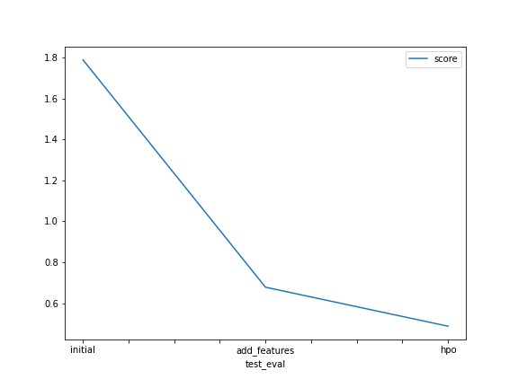

# Report: Predict Bike Sharing Demand with AutoGluon Solution
#### Shaik Masroor Ahmed

## Initial Training
### What did you realize when you tried to submit your predictions? What changes were needed to the output of the predictor to submit your results?
I realized there were some changes to be made in the and to remove few columns which were redundant and would not contribute to the overall result. Data cleaning provided a fast and clean approach for the process.

### What was the top ranked model that performed?
The top rank model was WeightedEnsemble_L3 which gave good results in each prediction. 

## Exploratory data analysis and feature creation
### What did the exploratory analysis find and how did you add additional features?
I found that there were datatypes which had to be changed to category and the datetime. The datetime column was then used to creat date, year, month and hour columns using the dt method.

### How much better did your model preform after adding additional features and why do you think that is?
The model kaggle score improved from 1.7 to 0.6 after the additional features. I believe this was due to the integer datatypes converted to the category dtypes and the datetime.

## Hyper parameter tuning
### How much better did your model preform after trying different hyper parameters?
The model score improved from 0.6 to 0.4 because of hyperparameter tuning. The tuning was mainly done to enhance the score and many iterations were tried upon. There is still a lot to explore and learn about hyperparameters as the behaviour of each parameter has its unique impact.

### If you were given more time with this dataset, where do you think you would spend more time?
The Autogluon module itself had given very good score but if given more time I would tweak more hyperparameters and increase the training time to see how the model behaves.

### Create a table with the models you ran, the hyperparameters modified, and the kaggle score.
|model|hpo1|hpo2|hpo3|score|
|--|--|--|--|--|
|initial|default|default|default|1.78963|
|add_features|default|default|default|0.67814|
|hpo|num_boost_round|num_leaves|NN_TORCH|0.48752|

### Create a line plot showing the top model score for the three (or more) training runs during the project.

TODO: Replace the image below with your own.

### Create a line plot showing the top kaggle score for the three (or more) prediction submissions during the project.

TODO: Replace the image below with your own.

## Summary
TODO: During the training and predict I understood how useful and powerful Autogluon is. I also understood the impact of hyperparameters and the use of Machine Learning in our daily and how we can benefit from it by using the real world datasets.
